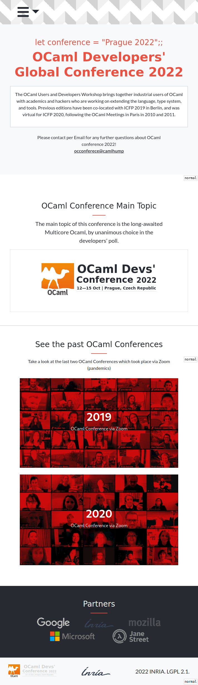
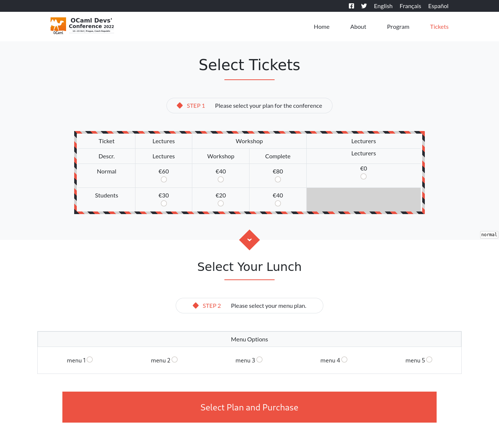

# OCaml Conference 2021 website
Microverse HTML and CSS capstone project
>In this project I created a webpage for a fictitious 2021 OCaml conference
>The design of this page was taken from [Benhance](https://www.behance.net/gallery/29845175/CC-Global-Summit-2015) and all the credit is due to [Cindy Shin](https://www.behance.net/adagio07)
>The website consists of a main page, an about page and a tickets sale page, and features both mobile (< 768px width) and desktop (≥ 768px width) versions

## Built With

- Html,
- Css,
- Bootstrap

## Linters Used:

- Lighthouse
- Weblint
- Stylelint

## Live Demo

- Project [Live Demo Link](https://notlfish.github.io/conference-website/tickets.html)

## Getting Started

- To get a local copy up and running follow these simple example steps.
- Install Bootstrap
- Open index.html in a Bootstrap-compatible browser.
- Navigate to the about and tickets page trough the links in the header navbar.

#### Prerequisites

- Have a compatible web browser that supports HTML5, CSS3, and Bootstrap in order to correctly display the website.
- A text editor in order to view and edit code. Popular text editors include VSCode and Notepad++.

#### Setup

On GitHub bash
   > git clone https://github.com/notlfish/conference-website

#### Usage

- Most Operative Systems have the .html file extension associated to open with your default web browser.
> In order to review the code, you may use your web browser inspect element option or open directly with a text editor.

- In the cloned folder access open
    _index.html_

## Authors

👤 **Lucas Ferrari Soto**

- GitHub: [@notlfish](https://github.com/notlfish)
- Twitter: [@LucasFerrariSo1](https://twitter.com/LucasFerrariSo1)
- LinkedIn: [LinkedIn](https://linkedin.com/lucas-mauricio-ferrari-soto-472a3515a)

## 🤝 Contributing

Contributions, issues, and feature requests are welcome!

Feel free to check the issues page.
Show your support

Give us a ⭐️ if you like this project!
## Acknowledgments

The design of this page is due to [Cindy Shin](https://www.behance.net/adagio07), licensed under a creative commons license.
